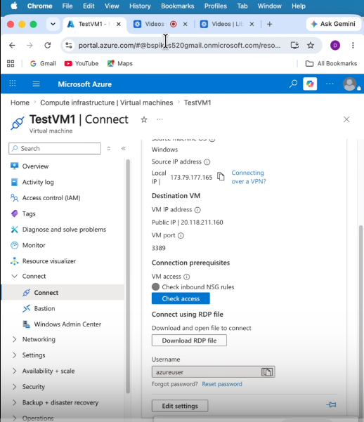
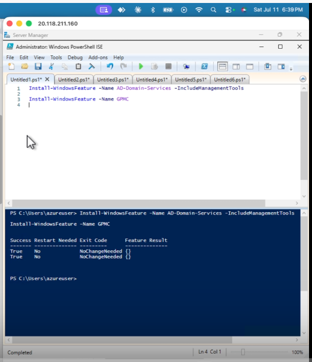
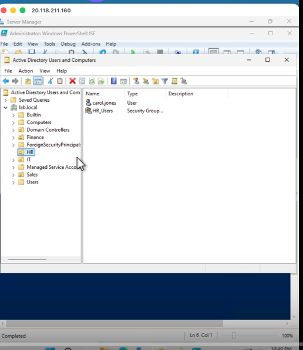
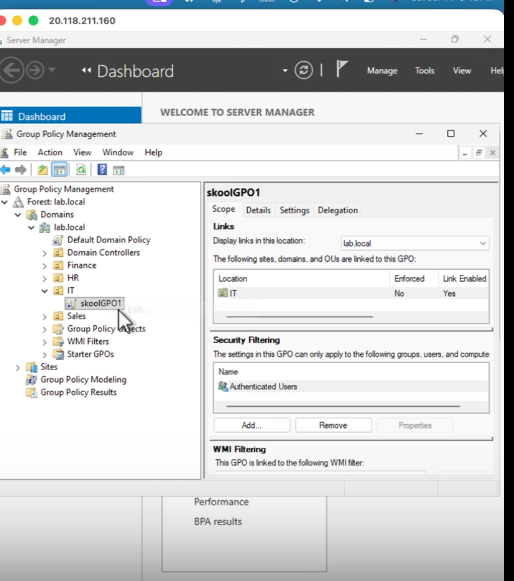
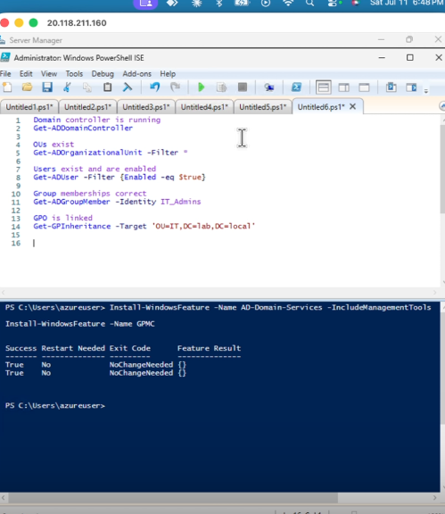

# Lab 1 — Active Directory Domain Services

**Platform:** Windows Server 2025 · Azure Free Account
**Domain:** Identity & Access Management (IAM)
**Status:** ✅ Complete

---

## Project Summary

This lab stands up a single-forest Active Directory domain (`lab.local`) from scratch on a Windows Server 2025 virtual machine, then builds out the organizational structure, security groups, and user accounts that a real IT department would use to manage employee access on day one. It closes with a Group Policy Object (GPO) that enforces password and lock-screen standards across a department, and a set of the help-desk tasks (password resets, account unlocks, offboarding) that make up the bulk of day-to-day identity administration work.

| Field | Value |
|---|---|
| Certification alignment | CompTIA Network+ · Security+ · Azure Administrator |
| Tools used | Windows Server 2025 Evaluation (180-day) · Azure Free Account |
| Time to complete | 3–5 hours across multiple sessions |
| Cost | $0 — covered by Azure free tier + evaluation license |
| Career relevance | IT Support · Sysadmin · Cloud Engineer · Security Analyst |

---

## The Business Problem

Every organization running Windows infrastructure — which is most enterprises — relies on Active Directory to answer one question: **who is allowed to do what?**

Active Directory is the identity backbone. It decides which users can log into which computers, which groups can reach which file shares, and which policies apply to which parts of the business. When a new employee joins, IT creates one account and adds it to the right groups; access to email, drives, printers, and applications follows automatically. When that person leaves, IT disables one account and every door closes at once.

This isn't legacy technology to check off a list. Hybrid environments run AD on-premises and sync identities to Microsoft Entra ID (formerly Azure AD) in the cloud, so the concepts built here — domains, OUs, groups, GPOs — map directly onto cloud identity work.

### Where this shows up on the job

| Role | How this lab applies |
|---|---|
| IT Support / Help Desk | Password resets, account unlocks, group membership changes — the top three ticket types in any enterprise |
| Sysadmin | Designing OU structure, deploying GPOs, managing domain-joined machines at scale |
| Cloud Engineer | Entra ID (cloud AD) uses the same concepts: users, groups, roles, conditional access. On-prem AD knowledge transfers directly |
| Security Analyst | AD is the most targeted system in ransomware attacks. Understanding how it works is the foundation of defending it |

---

## What This Lab Demonstrates

| Skill | Real-world application |
|---|---|
| Promote a Windows Server to Domain Controller | The first step in every enterprise Windows environment — you own the domain from this moment forward |
| Create Organizational Units (OUs) | OUs are the folders of Active Directory; they let different policies apply to different departments |
| Create users, groups, and group memberships | Every access decision in an enterprise is group-based. Do this correctly once and it scales to thousands of users |
| Configure Group Policy Objects (GPOs) | GPOs enforce settings across every machine in the domain — password policy, screen lock, software restrictions — centrally |
| Join a machine to the domain | Turns a workstation into a managed, policy-enforced resource |
| Configure role-based access with security groups | Applies least-privilege in practice: users only get what their job requires |
| Reset passwords and manage account lifecycle | The single most frequent real-world help-desk task |

---

## Architecture Built

```
Forest: lab.local
└── Domain Controller (WIN-DC01, Windows Server 2025 Datacenter)
    ├── OU: IT
    │   ├── Group: IT_Admins
    │   ├── User: alice.chen
    │   └── GPO: "IT Security Policy" (linked here)
    ├── OU: Finance
    │   ├── Group: Finance_Users
    │   └── User: bob.patel
    ├── OU: HR
    │   ├── Group: HR_Users
    │   └── User: carol.jones
    ├── OU: Sales
    │   ├── Group: Sales_Users
    │   └── User: david.smith
    └── OU: Computers
```

**VM sizing used (Azure):**

| Setting | Value | Why |
|---|---|---|
| Region | East US | Cheapest region, broadest free-tier VM availability |
| Image | Windows Server 2025 Datacenter — Gen2 | Latest server OS, includes free 180-day evaluation license |
| Size | Standard_B2s (2 vCPU, 4 GB RAM) | Smallest size that runs AD comfortably; covered by free-tier credit |
| Authentication | Password | Used to RDP in |
| Inbound ports | RDP (3389) | Required to connect from a local machine |
| OS disk | Standard SSD | Good performance, included in free-tier storage |

---

## Walkthrough & Screenshots

### 1. Azure VM provisioned



### 2. AD DS role + GPMC installed



### 3. Server promoted to Domain Controller (lab.local)

*Screenshot not yet captured — see Section 3 of the SOP for the promotion steps. Add one showing the post-restart Server Manager dashboard with the domain name visible.*

### 4. Organizational Units created in ADUC



*This same screenshot also shows a user (`carol.jones`) and a security group (`HR_Users`) inside the HR OU, so it doubles as evidence for Section 5 below.*

### 5. Security groups and users created

Covered by the screenshot in item 4 above. Add a dedicated screenshot here if you want each department's group/user pairing shown individually.

### 6. GPO linked to the IT OU



### 7. GPO enforcement verified (gpresult /r on a domain-joined VM)

*Screenshot not yet captured — requires a second VM joined to the domain and moved into the IT OU. See the "Test it" note in Section 5 of the SOP.*

### 8. Verification commands output



---

## Verification

| Check | Command | Expected result |
|---|---|---|
| Domain controller is running | `Get-ADDomainController` | Returns DC info including forest `lab.local` |
| OUs exist | `Get-ADOrganizationalUnit -Filter *` | Lists all 5 OUs created |
| Users exist and are enabled | `Get-ADUser -Filter {Enabled -eq $true}` | Lists the 4 test accounts |
| Group memberships correct | `Get-ADGroupMember -Identity IT_Admins` | Returns `alice.chen` |
| GPO is linked | `Get-GPInheritance -Target 'OU=IT,DC=lab,DC=local'` | Shows "IT Security Policy" as linked |

All checks passed — see `scripts/07-Verify-Lab.ps1` for the runnable version of this table.

---

## Repo Contents

```
lab-1-active-directory/
├── README.md                          ← this file
├── SOP-runbook.md                     ← step-by-step operational procedure
├── screenshots/                       ← drop lab screenshots here (see filenames above)
└── scripts/
    ├── 01-Install-ADDS-Role.ps1
    ├── 02-Promote-Domain-Controller.ps1
    ├── 03-Create-OUs.ps1
    ├── 04-Create-Security-Groups.ps1
    ├── 05-Create-Users.ps1
    ├── 06-HelpDesk-Tasks.ps1
    └── 07-Verify-Lab.ps1
```

## Lessons Learned / Notes

- `New-ADUser` requires the `$password` secure-string variable to be defined **before** the account-creation commands run in the same PowerShell session — running the block line by line causes PowerShell to prompt for a `Name` and fail. Run each script in full.
- RDP does not share the clipboard by default. Enable it via **Show Options → Local Resources → Clipboard** before connecting, or use the downloaded RDP file instead of the Azure portal's browser console.
- Stop (don't delete) the VM at the end of each session — a `Standard_B2s` VM runs about $0.05/hour, and stopping pauses compute billing so the free credit lasts across sessions.
